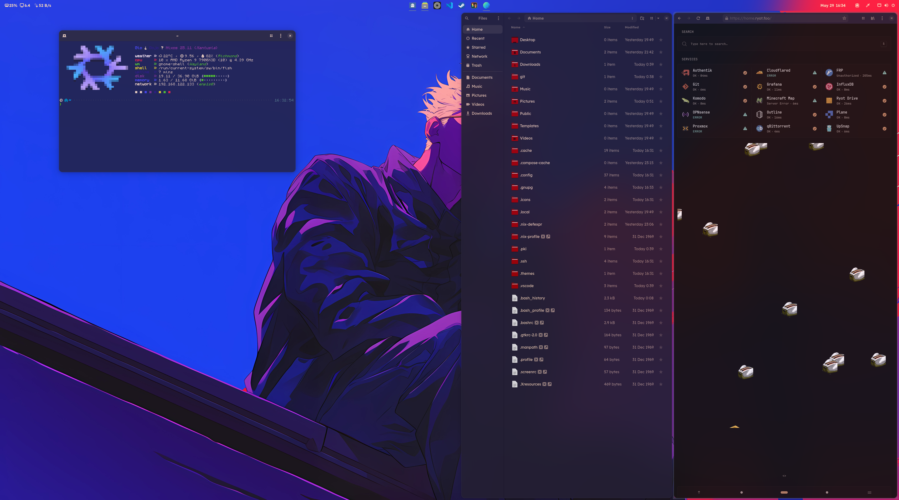
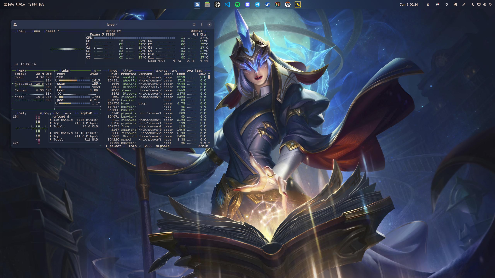

<h1> dot.nix</h1>

> **My NixOS & Home Manager Multi User/Host Configuration**
> A modular Nix flake managing multiple systems and users with a focus on reproducibility and ease of maintenance.
>
> [](https://deepwiki.com/TophC7/dot.nix)




---

## Architecture Overview

This repository is a **host-focused NixOS configuration** that manages system and user environments across multiple machines. It uses **flake.parts** for modularity and delegates packages, overlays, and custom library utilities to my library **mix.nix** for clean separation of concerns. See [mix.nix Integration](#mix-nix-integration) for more on that.

```
dot.nix/
├── flake.nix                       # Central entry using flake.parts
├── devshell.nix                    # Development shell configuration
├── CLAUDE.md                       # Claude Code integration & dev instructions
├── .mcp.json                       # Model Context Protocol server config
├── hosts/                          # NixOS system configurations (flat structure)
│   ├── rune/
│   └── ...
├── home/                           # Home Manager user environments
│   ├── hosts/                      # Per-host user overrides
│   └── users/                      # Per-user configurations
├── mix/                            # Host & user specifications, secrets
│   ├── default.nix                 # Host and user definitions (uses mix.nix)
│   ├── hostSpec.nix                # Host attribute schema
│   └── secrets.nix                 # Encrypted secrets (git-crypt)
├── modules/                        # Core NixOS & Home Manager modules
│   ├── hosts/
│   └── home/
├── dist/                           # ISO build configurations [WIP]
├── public/                         # Public assets & example secrets
└── .github/workflows/              # CI/CD automation
```

---

## Core Components

### **Flake Management (`flake.nix`)**
The central entry point using **flake.parts** for modularity:
- **External Dependencies**: `nixpkgs`, `home-manager`, `stylix`, `hardware modules`, `mix-nix`, `play`, `solaar`, `chaotic`, `niri`, and others
- **System Outputs**: Complete NixOS configurations auto-generated from host specifications
- **Library Extension**: Extends `nixpkgs.lib` with utilities from **mix.nix** (`lib.fs.*`, `lib.hosts.*`, etc.)
- **Flake Modules**: Imports from mix.nix and local `./mix` directory for host/user management

### **Secret Management**
- **Encryption**: `git-crypt` secures sensitive data in `mix/secrets.nix`
- **Structure**: Defined by `mix/hostSpec.nix` and mix.nix library
- **Content**: SSH keys, API tokens, hashed passwords, SMTP credentials, VPN configurations

### **Host & User Specifications**
- **`mix/default.nix`**: Central orchestration point for the entire configuration using mix.nix:
  - **User Definitions**: Declares all users with their uid, shell, and group memberships
  - **Core Module Configuration**: Specifies `modules/hosts/core` as core modules applied to **all hosts** and `modules/home/core` as core Home Manager modules applied to **all users**
  - **Host Definitions**: Declares all hosts, each referencing a user and defining system-level settings (IP, desktop environment, mounts, VPN)
  - **Secrets & Directory Mapping**: Configures secrets file locations and maps host/user home directories
  - **Special Arguments**: Passes flake root and other arguments to all modules
- **`mix/hostSpec.nix`**: Type schema extending the mix.nix host specification with dot.nix-specific attributes. See [mix.nix documentation](https://github.com/TophC7/mix.nix?tab=readme-ov-file#type-extension) for the base schema and additional details.
- **`mix/secrets.nix`**: Encrypted secret structure and values
  - Example [secrets.example.nix](public/secrets.example.nix)

---

## System Architecture (`hosts/`)

Each host configuration is located at `hosts/<hostname>/` and follows this pattern:
- **`default.nix`**: Main configuration that imports hardware modules, host-specific service configurations, and optional common modules.
- **`config/`**: Optional service-specific configurations and customizations that are auto-discovered and imported

### Current Hosts

| Host       | Type    | Purpose                | Hardware                    | Services                                           |
| ---------- | ------- | ---------------------- | --------------------------- | -------------------------------------------------- |
| **rune**   | Desktop | Workstation            | Ryzen 9 7900X3D, RX 9070 XT | Gaming, Development, VMs                           |
| **haze**   | Desktop | Cesar's workstation    | Ryzen 5 7600x, RX 7600      | Gaming, Development                                |
| **norion** | Laptop  | Work laptop            | Ryzen AI 9 HX PRO 370       | Development, OLM client                            |
| **zebes**  | Server  | Main server            | Ryzen 7 5700X, RX 7900 GRE  | Komodo (Docker), AI (Ollama, ComfyUI), Explorer    |
| **nimbus** | Server  | Storage server         | Ryzen 5 5600G               | ZFS/BTRFS storage, NFS, FileRun, Backups, Newt     |
| **nexus**  | Server  | Router & services host | Intel N150 (2C), 2GB        | Router, DHCP, DNS, AdGuard, Rathole, WireGuard VPN |
| **caenus** | Server  | ARM VPS                | ARM 4vCPU, 24GB RAM, 200GB  | Rathole server, Public IP endpoint                 |
| **vm**     | VM      | Testing environment    | Variable                    | System testing                                     |

---

## User Environment (`home/`)

User configurations are organized into two directories:

### **User-Specific Configurations**
Located in `home/users/<username>/`, these configurations apply globally across all hosts for that user. Core Home Manager modules (shell, Git, SSH, etc.) are imported by mix.nix. This directory is for user-specific customizations and preferences that should be consistent across all machines the user accesses:
- **Theme Configuration**: Stylix-based theming with wallpaper-generated color schemes
- **Custom Overrides**: User-specific program configurations and preferences

### **Host-Specific Overrides**
Located in `home/hosts/<hostname>/`, these configurations override or extend user settings on specific machines:
- **Monitor Configurations**: Per-host monitor layouts via mix.nix
- **Desktop Customizations**: GNOME dconf or desktop-specific settings
- **Host-Specific Theming**: Theme variations tailored to each workstation

### Current Users

| User      | Theme      |
| --------- | ---------- |
| **toph**  | Invincible |
| **cesar** | Soraka     |

---

## Theming & Customization

### **Desktop Environments**
- **GNOME**: PaperWM for tiling workflow, GNOME extensions (Blur My Shell, Vitals, Pano), and dconf customizations for enhanced usability
- **Niri**: Wayland compositor with Vicinae application launcher for quick program access, available on designated hosts
- **Per-Host Customization**: Monitor layouts, dconf settings, and UI tweaks customized per workstation via `home/hosts/<hostname>/`

---

## mix.nix Integration

This repository depends on **mix.nix**, a reusable library that provides:

### **Declarative Host Management**
- Automatic `nixosConfigurations` generation from host specifications
- User definition and reference system across multiple hosts
- Seamless secrets access across all hosts via git-crypt integration (mix.nix expects encrypted secrets to be available)

### **Library Utilities**
- **`lib.fs.*`**: File system utilities (path scanning, relative paths)
- **`lib.hosts.*`**: Host management utilities
- **`lib.desktop.*`**: Desktop environment helpers
- And many other utility functions

### **Flake-Parts Modules Provided by mix.nix**
mix.nix provides flake-parts modules that integrate seamlessly into this repository's flake:
- **hosts**: Auto-generates NixOS configurations from host specifications in `mix/default.nix`
- **secrets**: Manages encrypted secrets access and validation
- **modules**: Discovers and imports Nix modules from the configured directories
- **overlays**: Provides custom package overlays system
- **packages**: Exposes custom package definitions

### **Home Manager Modules**

#### **theme** - Unified Theming System
The `theme` module from mix.nix provides a centralized theming specification that can be applied at either the user or host level:
- **Wallpaper-Based Color Generation**: Automatically generates Material You color schemes from your wallpaper using matugen
- **Customizable Schemes**: Supports multiple Material Design schemes (expressive, tonal-spot, vibrant, and more)
- **Per-User & Per-Host Flexibility**: Define themes in `home/users/<username>/` for consistent theming across all hosts, or in `home/hosts/<hostname>/` for host-specific variations
- **Icon & Cursor Theming**: Declarative specification of icon themes (Papirus, etc.) and cursor themes
- **Integration Points**: Provides theme values that are consumed by Stylix and other configuration modules to apply colors system-wide (GTK, terminal, VS Code, etc.)

#### **Other Home Manager Modules**
- **monitors**: Declarative multi-monitor configuration
- **fastfetch**: System information display
- **nautilus**: GNOME Files configuration including GTK bookmarks and custom folder icons

### **NixOS Modules**
- **newt**: Tunneling service for zero-trust access
- **olm**: OLM client for Pangolin network access
- **oci-stacks**: OCI container stack management

For complete mix.nix documentation, see [github.com/tophc7/mix.nix](https://github.com/tophc7/mix.nix).

---

## Notable Features

### Enhanced Gaming
- **Optimized Stack**: Steam integration with Proton, GameScope, and GameMode.
- **Hardware Tuning**: AMD GPU specific settings (e.g., `lact` for tuning) and Variable Refresh Rate (VRR) support.

### Robust Storage & Backups
- **Multi-Tier Storage Architecture**:
  - `/tank` - Cold storage for archival data (from nimbus)
  - `/fast` - Performance storage for active projects (from nimbus)
  - `/store` - Service data and Docker volumes (from zebes)
  - `/repo` - Shared repository access across all hosts
- **Reliable NFS Mounts**: Systemd-based mounting with automount for improved reliability
- **Data Integrity**: ZFS/BTRFS filesystems with snapshots and data protection
- **Comprehensive Backups**: Incremental backups of critical data, Docker volumes, and Forgejo instances with Apprise notifications
- **Automated Backup Chain**: Systemd timers orchestrate automated backups and data synchronization

### Streamlined Desktop & User Experience
- **Custom Fish Shell**: Enhanced with the Tide prompt, `grc` for colorized output, and utility functions
- **Modern Terminal**: `ghostty` as the default terminal emulator, themed with Stylix
- **Efficient File Management**: `yazi` configured as the terminal file manager
- **Curated Applications**: Configurations for Zen browser, VS Code, and more
- **XDG & Mime Associations**: Sensible default applications configured via `xdg.mimeApps` with `handlr-regex`
- **Claude Code Integration**: Enhanced with custom output styles and MCP server for NixOS-aware assistance

### Advanced Container Management
- **Docker Orchestration**: Komodo provides a web UI for managing Docker stacks
- **Explorer Service**: Modern file browser deployed on nimbus and zebes for easy file access
- **Key Services**: Pre-defined configurations for Pangolin (reverse proxy), FileRun, and Explorer
- **Declarative Stacks**: `compose2nix` converts Docker Compose files into NixOS declarative modules

### Integrated Security
- **Secure Remote Access**:
  - Pangolin network with OLM for Zero Trust access
  - WireGuard VPN for direct homelab connectivity
  - Rathole tunneling for reliable external access
- **Automated Certificates**: ACME (Let's Encrypt) with DNS challenges for SSL/TLS
- **SSH Key Deployment**: Automated management and deployment of SSH keys

### AI & Machine Learning
- **Ollama**: Local LLM inference for text generation and analysis
- **Native ComfyUI**: Deployed as a Systemd service with Python venv
- **GPU Acceleration**: Optimized for AMD RX 7900 GRE with ROCm 6.4 support
- **Flexible Deployment**: Self-managed Python environments with automatic dependency handling

### Advanced Networking
- **Full Router Capabilities**: Nexus serves as complete router with NAT, firewall rules, and packet forwarding
- **DHCP Server**: Dynamic IP allocation with static reservations for known hosts
- **DNS Management**: AdGuard Home for ad-blocking and DNS filtering with search domains
- **WireGuard VPN**: Direct homelab access with automatic DNS configuration
- **Rathole Tunneling**: High-performance tunneling for external access
- **Service Discovery**: Automatic routing between internal networks and services
- **Zero Trust Access**: Pangolin network with secure tunneling via Newt

---

## Usage & Deployment

### **Initial System Installation**

For setting up a new system (in NixOS) with this configuration:

#### **1. Clone Configuration Repository**
```bash
# Enter development shell with necessary tools for installation
nix develop github:TophC7/dot.nix --extra-experimental-features "flakes nix-command"

# Clone the configuration repository using yay try
FLAKE=~/Documents/dot.nix
cd ~/Documents
git clone https://github.com/tophc7/dot.nix
```

#### **2. Unlock Encrypted Secrets**
```bash
cd ~/Documents/dot.nix
git-crypt unlock <<path/to/symmetric.key>> # Or use GPG key
```

<details>
<summary><b>Setup Your Own Secrets</b></summary>

Since you won't have access to the encrypted secrets, create your own:

```bash
cd ~/Documents/dot.nix

# Copy the example and customize it
cp lib/public/secrets.example.nix secrets.nix

# Edit with your credentials, SSH keys, etc.
micro secrets.nix

# Initialize git-crypt for your secrets
git-crypt init
git-crypt add-gpg-user YOUR_GPG_KEY_ID
```

After setting up your secrets, encrypt the file:
```bash
git add secrets.nix
git-crypt lock
```

</details>

#### **3. Configure Hardware Settings**
1. Compare hardware configurations:
   ```bash
   micro ~/Documents/dot.nix/hosts/<hostname>/hardware.nix
   micro /etc/nixos/hardware-configuration.nix
   ```

2. Update hardware.nix with the `fileSystems` and `swapDevices` from the generated `/etc/nixos/hardware-configuration.nix`

#### **4. Install Configuration (TTY Recommended)**
1. Switch to TTY: `Ctrl+Alt+F2` (to avoid desktop service conflicts)
2. Login to TTY
3. Rebuild system:
   ```bash
   # Enter development shell again with necessary tools for installation
   nix develop github:TophC7/dot.nix --extra-experimental-features "flakes nix-command"

   # Rebuild with your host configuration
   yay rebuild -H your-hostname -p ~/Documents/dot.nix
   sudo reboot -f
   ```

### **Day-to-Day System Management**

Once installed, use the integrated `yay` tool for all system management:

```bash
# Build and switch system configuration
yay rebuild

# Update flake inputs
yay update

# Clean up system
yay garbage

# Try packages temporarily
yay try fastfetch -- fastfetch

# Create archives
yay tar myfiles/

# Extract archives
yay untar myfiles.tar.zst
```

### **Environment Variables**
- **`FLAKE`**: Set to your flake directory to avoid using `-p` flag repeatedly
  ```bash
  export FLAKE="$HOME/Documents/dot.nix"
  yay rebuild  # Will automatically use $FLAKE path
  ```

---

## ISO Generation [WIP]

ISO building is currently broken. The `dist/` directory contains a new ISO build system that follows a simplified mix.nix configuration, but it's currently non-functional and undocumented. This directory is intended to serve as a template for starting your own configuration based on dot.nix once finished.

---
## Development Philosophy

### Modularity
- **Separation of Concerns**: System vs. user configurations, separated from packages/overlays (via mix.nix)
- **Reusable Components**: Shared modules across hosts
- **Parameterization**: Host specs drive configuration choices

### Maintainability
- **Structured Secrets**: Clearly defined secret specifications in git-crypt encrypted files
- **Documentation**: Inline comments and clear naming conventions
- **Testing**: VM and test configurations for safe experimentation

### Flexibility
- **Multiple Users**: Support for different users with different preferences
- **Host Adaptation**: Same user config adapts to different machines
- **Service Composition**: Mix and match services per host needs

---

## Key Technologies

| Category           | Technologies                                                                                 |
| ------------------ | -------------------------------------------------------------------------------------------- |
| **Core**           | NixOS, Home Manager, Nix Flakes, mix.nix                                                     |
| **Shell**          | Fish Shell, Tide Prompt                                                                      |
| **Desktop**        | GNOME, Niri, PaperWM, Stylix, Ghostty, Yazi                                                  |
| **Virtualization** | libvirt, QEMU, LXC                                                                           |
| **Storage**        | ZFS, BTRFS, BorgBackup, NFS, `inotify-tools`                                                 |
| **Containers**     | Docker, Komodo, compose2nix                                                                  |
| **Networking**     | Router, DHCP, DNS, WireGuard VPN, Rathole, Newt, Pangolin, OLM, AdGuard Home, Cloudflare DNS |
| **AI/ML**          | Ollama, ComfyUI, Stable Diffusion                                                            |
| **Reverse Proxy**  | Traefik (via Pangolin)                                                                       |
| **Security**       | git-crypt, ACME, Zero Trust tunneling                                                        |
| **Development**    | VS Code, `nixfmt`, `biome`, Claude Code                                                      |
| **Gaming**         | Steam, Proton, GameScope, GameMode, `lact`                                                   |
| **Monitoring**     | Apprise notifications, systemd timers                                                        |
| **CI/CD**          | GitHub Actions                                                                               |

## Quick Reference

### Key Configuration Files 
- `mix/default.nix` - Host and user specifications defined with mix.nix
- `mix/hostSpec.nix` - Host attribute schema extension
- `mix/secrets.nix` - Encrypted secrets (git-crypt)
- `modules/hosts/` - Core NixOS modules applied to all hosts
- `modules/home/` - Core Home Manager modules applied to all users
- `CLAUDE.md` - Development instructions for Claude Code
- `.mcp.json` - Model Context Protocol server configuration
- `flake.nix` - Central dependency management and flake-parts entry point
- `devshell.nix` - Development shell configuration

### Frequently Modified Directories
- `home/users/<username>/` - Individual user configurations
- `home/hosts/<hostname>/` - Host-specific user overrides and customizations
- `hosts/<hostname>/` - Host-specific system configurations
- `hosts/<hostname>/hardware.nix` - Hardware-specific settings per host
- `hosts/<hostname>/config/` - Optional service-specific configurations

### Development Workflow
- `devshell.nix` - Development environment for the flake
- `.github/workflows/` - CI/CD automation
- `dist/` - ISO build system (separate flake, currently WIP)

---

## Credits & Acknowledgments

This configuration was originally inspired by **[EmergentMind's configuration](https://github.com/EmergentMind/nix-config)**, which provided an excellent introduction to modular NixOS configurations. While early versions drew heavily from their architecture, this configuration has since evolved significantly with the integration of **mix.nix** and represents a distinct approach to multi-host NixOS management.

A thank you to @EmergentMind for the foundational concepts that helped shape this journey.

---

This configuration emphasizes **reproducibility**, **security**, and **maintainability** while supporting a complex multi-user, multi-host homelab environment. I quite love it, hope it serves as inspo to some of you out there.